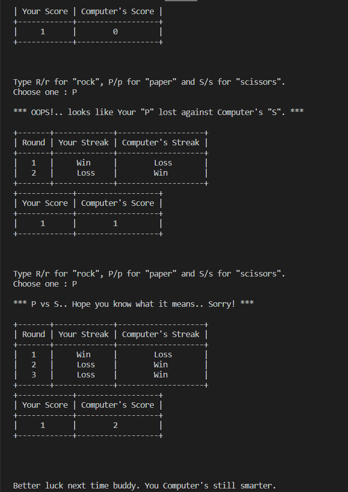

# roShamBo-CLI
An interactive version of the game called Ro-Sham-Bo, or better known as Rock-Paper-Scissors, which here is mapped to be played within the Command Line Interface itself.  

The thing that makes this version a bit more intriguing is it's capacity to **handle almost all kinds of bad input** by the user and the **depiction of the Winning or Losing streak** in the form of tables.  

There's obviously no need to specify the rules to play!  

