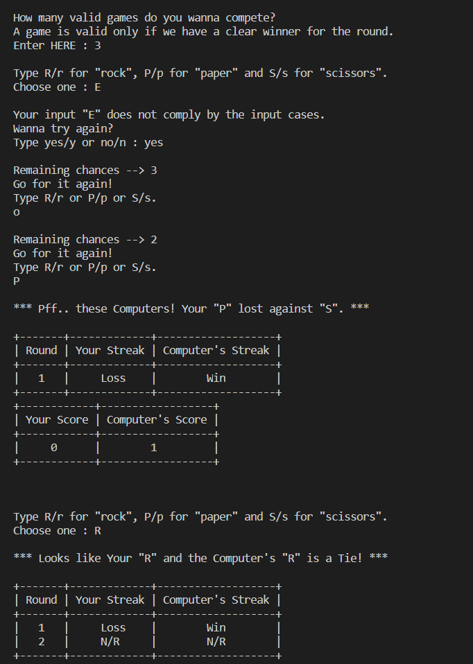

# Ro Sham Bo
An interactive version of the game called Ro-Sham-Bo, or better known as Rock-Paper-Scissors, which here is mapped to be played within the Command Line Interface itself.  

The thing that makes this version a bit more intriguing is it's capacity to **handle almost all kinds of bad input** by the user and the **depiction of the Winning or Losing streak** in the form of tables.  

There's obviously no need to specify the rules to play!  

### Requirement.
Run the command to update pip from the command line:  
```
pip install --upgrade pip
```
Run the command to install the **PrettyTable** module:  
```
pip install prettytable
```
  
  
### A snapshot from the gameplay.
  
Another piece that makes it a bit more interesting is the code randomly choosing the result statement from a list of given statements for each of the result cases, making the outcome of each round a bit more engrossing.  
  
  
### A snapshot of bad input case.
  
We can change the number of chances given to the user, which by default is 3, to rectify the bad input and go with a valid input.  
  
  
### PS.
Doesn't matter if the user gives an **even number** as an input for the number of rounds to be played, the winning score will always be considered as the ceil value of the rounds/2.
